

    
    <h2>Loopar Framework with React 18</h2>

___
### Integrated with
> React 18 via CDN
>
> GPT via OpenAI API, to generate documents
> 
> Srtripe API, to manage payments

___
> ### Loopar includes the following functionalities:

1. Dynamic Documents (documents, forms, pages). 
    with the following features:
    - Dynamic documents.
    - Dynamic forms.
    - Dynamic tables.
    - Dynamic pages.
2. App Manager  (applications, modules, plugins). 
    with the following features:
    - App Manager.
    - Module Group Manager.
    - Module Manager.
3. File Manager.
4. User Manager.

___
### How to Install
> #### use `sudo` if it requires write permissions.
> 
1. `git pull https://github.com/alphabit-technology/loopar-framework.git`
2. `cd loopar-framework`
3. `npm install`
4. `npm run dev`
5. Install Mysql Server in local or use remote server.
6. continue in your browser

# Short Component review
### Document Designer
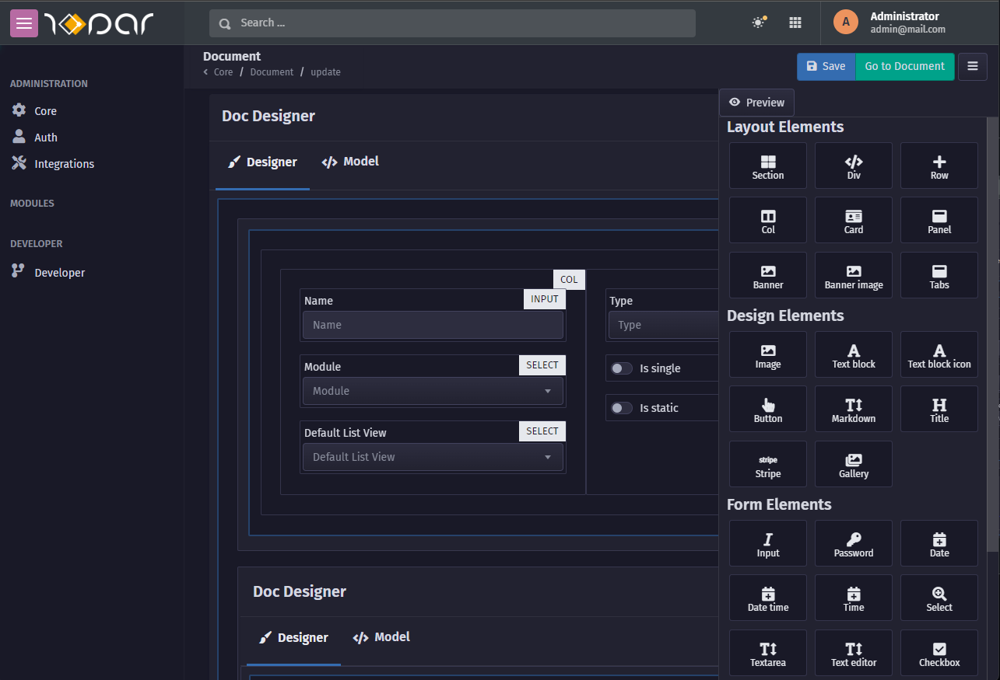
#### Generate Via GPT
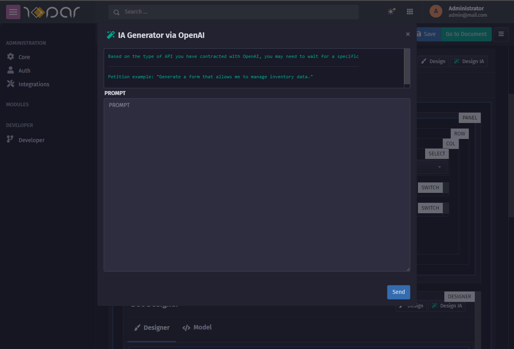
#### Preview
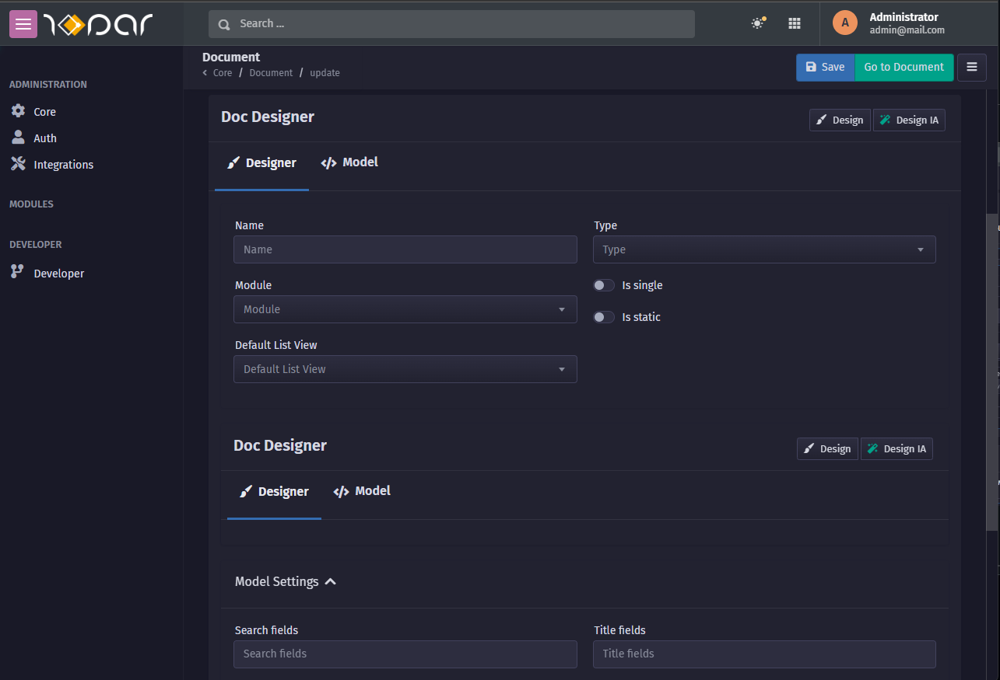
### Page Generator
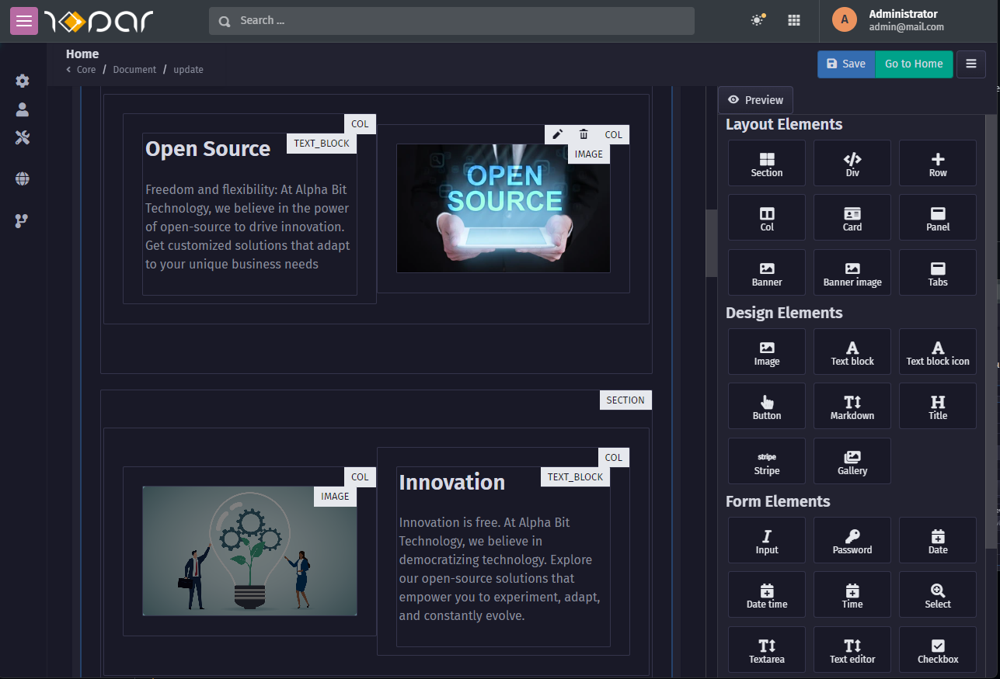
#### Page Preview
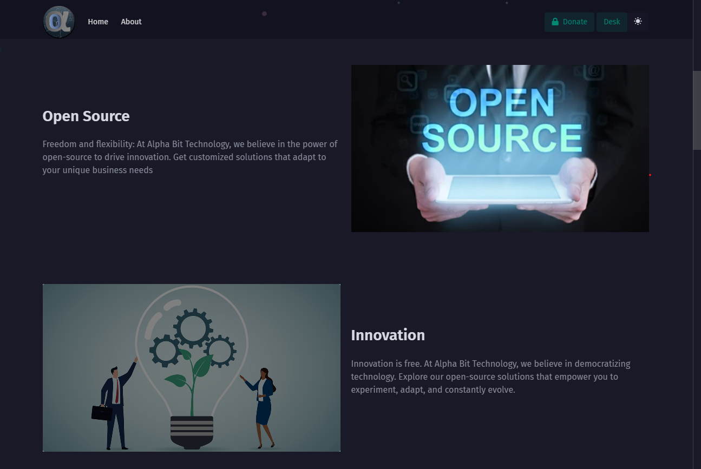

### List View
Generate based on the Document Structure
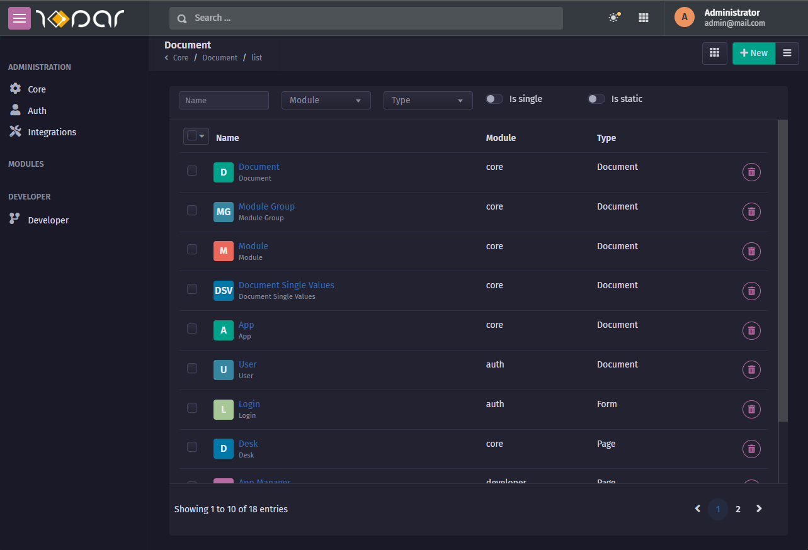

### Module View
Generate based on the modules that are installed
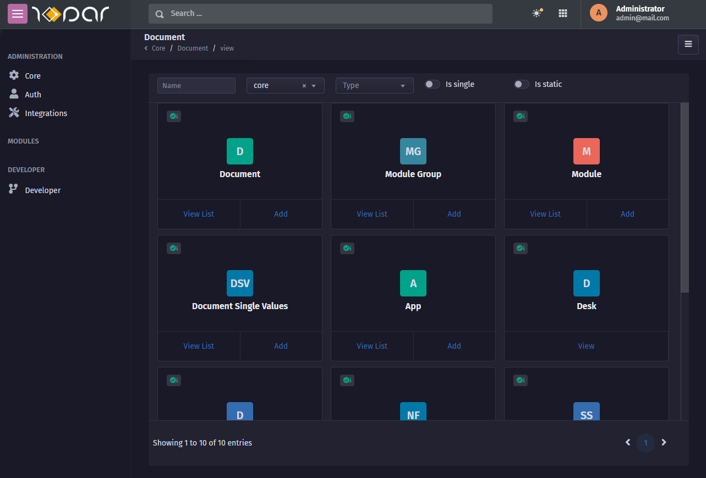

### File Manager
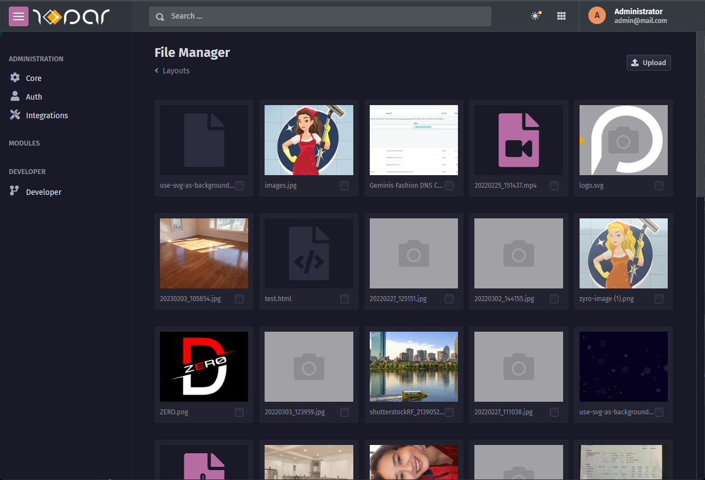

### Integrations
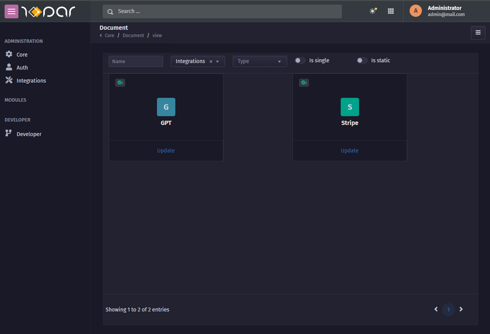

#### GPT Document Designer
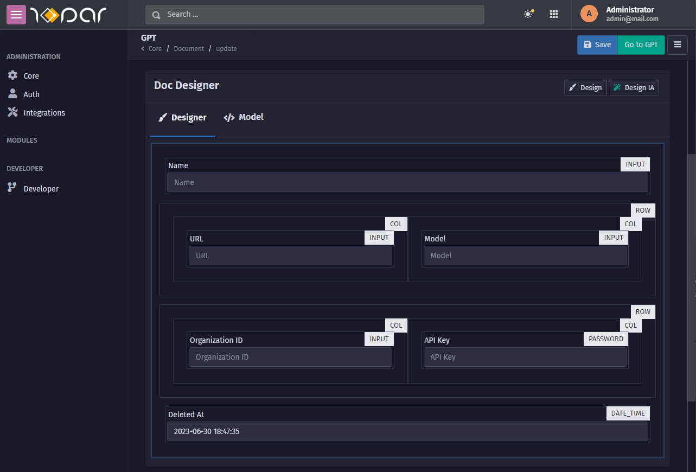
#### GPT API Create
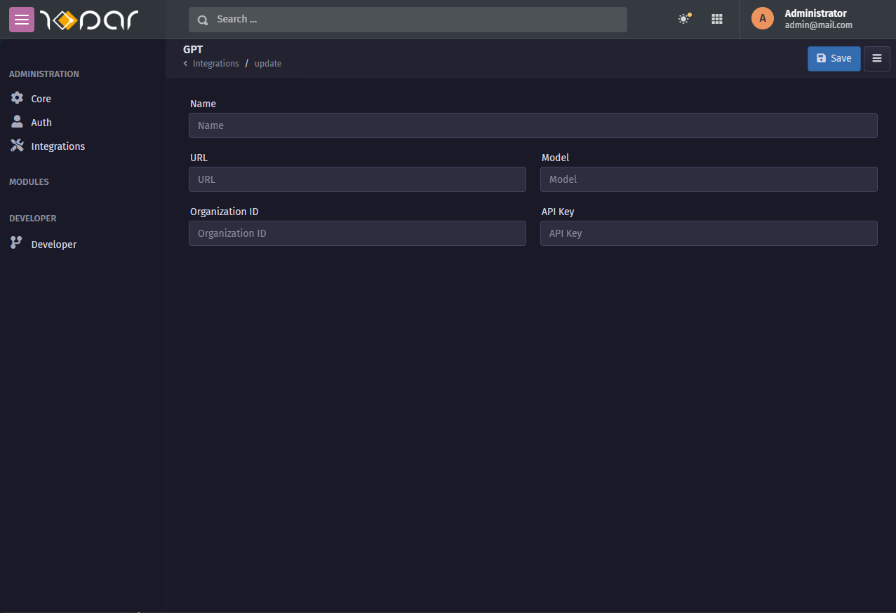

___
### How to Use
> See the documentation [here](https://github.com/alphabit-technology/loopar-framework/wiki)

___
### Requirements
> Test in Ubuntu WSL
>
> Node 18+
> 
> Mysql 7+

___

### License
> GNU / General Public License (see [license.txt](license.txt))

> The Loopar code is licensed under the GNU General Public License (v3).
